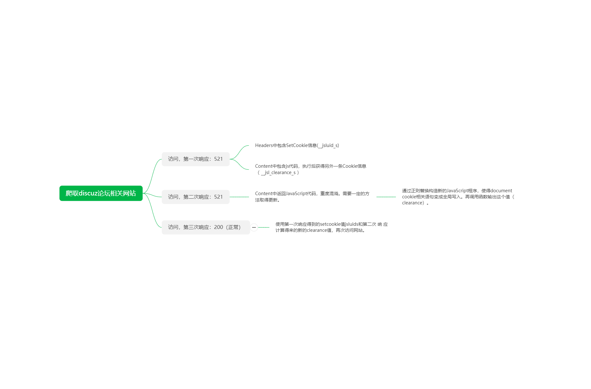

## execjs的运用
### 环境
1. 本地Node.js，并安装jsdom NPM包，构造本地header,ducument等环境。

### 需求
在爬取红网论坛时出现521错误，在百度、谷歌等查询资料后发现这是启用了反爬虫技术。运用Fiddler抓包在无痕模式下访问红网论坛的过程中发现，访问论坛经过了两次cookie的写入。故需要在爬虫程序中加入此步骤模拟浏览器正常访问红网论坛。

### 流程

